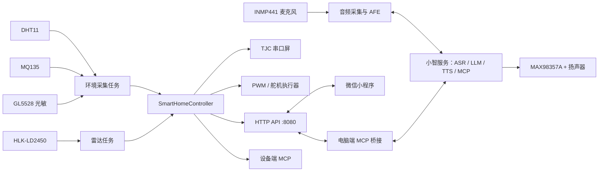

# Smart Home Controller

基于 ESP32-S3 与小智 AI 固件扩展的智能家居控制终端，集成语音交互、环境监测、毫米波雷达、TJC 串口屏、局域网 HTTP API、微信小程序和 MCP 工具链。

本仓库的正式代码位于 `main` 分支。固件工程位于 [`xiaozhi-esp32/`](xiaozhi-esp32/)，微信小程序演示位于 [`mini_program_demo/`](mini_program_demo/)。

## 项目概览

项目以 `bread-compact-wifi` 板型为硬件基线，在开源小智 ESP32 固件上增加了一套完整的智能家居演示链路：

- INMP441 麦克风与 MAX98357A 功放负责语音输入输出。
- Wi-Fi 接入小智服务，提供 ASR、LLM、TTS、OTA 和 MCP 调用能力。
- DHT11、MQ135、GL5528 光敏模块和 HLK-LD2450 雷达采集环境与人员状态。
- TJC 4.3 英寸串口屏显示温湿度、空气评分、趋势、设备状态和控制页面。
- GPIO PWM 与舵机输出模拟净化器、加湿器和新风设备。
- 局域网 HTTP API 同时服务微信小程序、调试脚本和电脑端 MCP 桥接。
- 自动模式、节能模式和手动环境场景共用同一个状态控制器。

当前固件版本为 `2.2.6`，目标芯片为 ESP32-S3，ESP-IDF 组件清单要求 ESP-IDF `>= 5.5.2`。

## 功能状态

| 模块 | 当前状态 | 说明 |
| --- | --- | --- |
| 小智 AI 语音 | 已实现 | Wi-Fi 配网、唤醒、流式 ASR/LLM/TTS、OTA、MCP |
| DHT11 温湿度 | 已实现 | 5 秒采样，失败时保留最近有效值 |
| MQ135 空气质量 | 已实现 | ADC 原始值、演示级空气评分和建议；尚未完成 ppm 标定 |
| GL5528 光敏 | 已实现 | ADC 采样、反向标定、平滑滤波和自动灯光逻辑 |
| HLK-LD2450 雷达 | 已实现 | UART1 目标帧解析，最多 3 个目标 |
| TJC 串口屏 | 已实现 | 4 个页面、GBK 中文、触摸事件、趋势曲线 |
| 智能家居执行器 | 已实现 | 净化/加湿 PWM 指示与舵机新风演示输出 |
| 自动与节能模式 | 已实现 | 根据环境数据自动调整设备档位 |
| HTTP API | 已实现 | 端口 `8080`，状态、历史、设备、模式、环境和报警接口 |
| 微信小程序 | 已实现 | 局域网状态查看、设备控制和场景模拟 |
| MCP 桥接 | 已实现 | 将小智平台工具调用转发到 ESP32 HTTP API |
| 实际照明输出 | 待接入 | 已有灯光状态、规则、API 和 MCP，尚未绑定独立 GPIO |
| 专业空气检测 | 待标定 | MQ135 当前仅用于课程/演示，不可替代专业仪器 |

## 系统架构



核心设计原则是所有控制入口共用 [`SmartHomeController`](xiaozhi-esp32/main/boards/bread-compact-wifi/smart_home_controller.cc)：串口屏、HTTP、小程序、设备端 MCP 和电脑端桥接不会维护互相冲突的独立状态。

## 仓库结构

```text
Smart-Home-Controller/
├── README.md                         项目总览与快速开始
├── xiaozhi-esp32/                    ESP-IDF 固件主工程
│   ├── main/                         应用、音频、协议、显示和板级代码
│   │   └── boards/bread-compact-wifi/
│   │       ├── compact_wifi_board.cc 板级入口与任务初始化
│   │       ├── config.h              GPIO、UART、ADC、I²S 和 PWM 配置
│   │       ├── *_sensor.*            DHT11、MQ135、光敏和 LD2450 驱动
│   │       ├── serial_hmi.*          TJC 串口屏显示与事件协议
│   │       ├── smart_home_controller.* 智能家居状态和自动控制
│   │       └── smart_home_http_server.* 局域网 HTTP API
│   ├── tools/xiaozhi_mcp_bridge/     电脑端 MCP 桥接服务
│   ├── scripts/                      构建、烧录和联调辅助脚本
│   ├── tests/                        Python 回归测试
│   ├── docs/                         固件开发与阶段交付文档
│   └── partitions/                   Flash 分区表
├── mini_program_demo/                微信小程序局域网演示工程
├── 文档/                              中文项目说明、接线和验证手册
└── 资料/                              传感器、串口屏和雷达参考资料
```

编译目录、ESP-IDF 依赖缓存、`sdkconfig`、本机微信开发者工具配置、测试日志和临时 HMI 文件均已通过 `.gitignore` 排除。克隆仓库后可由 ESP-IDF 自动重新生成这些内容。

## 硬件清单

建议准备以下硬件：

| 类别 | 型号/说明 |
| --- | --- |
| 主控 | ESP32-S3，建议 16MB Flash |
| 麦克风 | INMP441 I²S 数字麦克风 |
| 音频输出 | MAX98357A I²S 功放 + 扬声器 |
| 温湿度 | DHT11 |
| 空气质量 | MQ135 模拟输出模块 |
| 光照 | GL5528 类光敏模拟模块 |
| 人体感知 | HLK-LD2450 毫米波雷达 |
| 显示与触控 | TJC4827T143 类 4.3 英寸 USART HMI 串口屏，480×272 |
| 执行器演示 | 两路 LED + 限流电阻、舵机/风扇机构 |
| 供电 | 稳定的 5V 电源；舵机、屏幕和雷达应按模块规格供电 |

## GPIO 与接口

以下映射来自 [`config.h`](xiaozhi-esp32/main/boards/bread-compact-wifi/config.h)：

| 功能 | ESP32-S3 引脚 | 接口参数 |
| --- | ---: | --- |
| INMP441 WS | GPIO4 | I²S 输入 |
| INMP441 SCK | GPIO5 | I²S 输入 |
| INMP441 SD | GPIO6 | I²S 输入 |
| MAX98357A DIN | GPIO7 | I²S 输出 |
| MAX98357A BCLK | GPIO15 | I²S 输出 |
| MAX98357A LRC | GPIO16 | I²S 输出 |
| DHT11 DATA | GPIO18 | 单总线 |
| MQ135 AO | GPIO1 | ADC1_CH0 |
| 光敏模块 AO | GPIO2 | ADC1_CH1，仅允许 3.3V 范围模拟信号 |
| LD2450 TX → ESP RX | GPIO11 | UART1，256000 8N1 |
| LD2450 RX ← ESP TX | GPIO12 | UART1，256000 8N1 |
| TJC RX ← ESP TX | GPIO41 | UART2，9600 8N1 |
| TJC TX → ESP RX | GPIO42 | UART2，9600 8N1 |
| 净化器指示 | GPIO13 | 5kHz PWM，0～3 档 |
| 加湿器指示 | GPIO14 | 5kHz PWM，0～3 档 |
| 新风舵机 | GPIO21 | 50Hz PWM |
| BOOT 按键 | GPIO0 | 配网/聊天状态 |
| 说话按键 | GPIO47 | 按下监听、松开停止 |
| 音量加/减 | GPIO40 / GPIO39 | 单击调节、长按最大/静音 |

> 上电前务必共地。舵机、串口屏、雷达等负载不要直接依赖开发板弱电源输出；出现 `Brownout detector was triggered` 时应先排查供电，而不是继续判断软件功能。

完整接线请阅读：

- [`板级代码连线表`](文档/板级代码连线表.md)
- [`智能家居外设接线与验证步骤`](文档/智能家居外设接线与验证步骤.md)
- [`LD2450 雷达与光敏模块接线验证`](文档/LD2450雷达与光敏模块接线验证.md)
- [`硬件连接与软件验证步骤`](文档/硬件连接与软件验证步骤.md)

## 快速开始

### 1. 克隆 `main` 分支

```bash
git clone --branch main https://github.com/yythlss/Smart-Home-Controller.git
cd Smart-Home-Controller/xiaozhi-esp32
```

### 2. 安装开发环境

推荐环境：

- ESP-IDF `5.5.2` 或更高兼容版本
- Python 3.10+
- CMake、Ninja、Git
- VS Code + Espressif IDF 扩展，或 ESP-IDF 命令行环境

确认环境：

```bash
idf.py --version
python --version
```

### 3. 编译固件

推荐使用板型发布脚本，它会读取 `main/boards/bread-compact-wifi/config.json`，自动选择 ESP32-S3 和板型配置：

```bash
python scripts/release.py bread-compact-wifi
```

也可以手动配置：

```bash
idf.py set-target esp32s3
idf.py menuconfig
```

在菜单中进入 `Xiaozhi Assistant -> Board Type`，选择 `bread-compact-wifi`，保存后执行：

```bash
idf.py build
idf.py -p COMx flash monitor
```

Windows 用户将 `COMx` 替换为实际串口，例如 `COM7`；Linux 用户通常使用 `/dev/ttyUSB0` 或 `/dev/ttyACM0`。

### 4. 首次启动

1. 打开串口监视器，确认固件正常启动且没有 Brownout/重复重启。
2. 按设备提示完成 Wi-Fi 热点配网。
3. 按小智平台提示完成设备激活。
4. 记录设备获得的局域网 IP。
5. 浏览器访问 `http://<ESP32_IP>:8080/api/state`。

若能返回 JSON，说明 Wi-Fi、控制器和 HTTP API 的基础链路已工作。

## HTTP API

HTTP 服务在设备连入 Wi-Fi 后启动，默认端口为 `8080`。

| 方法 | 路径 | 用途 |
| --- | --- | --- |
| GET | `/api/state` | 当前传感器、模式、执行器、雷达和报警状态 |
| GET | `/api/history` | 最近 30 条环境采样记录 |
| POST | `/api/device` | 控制净化器、新风/风扇、加湿器和灯光 |
| POST | `/api/mode` | 开关自动模式或节能模式 |
| POST | `/api/environment` | 启用手动环境或预设场景 |
| POST | `/api/context` | 更新人员、亮度等上下文 |
| POST | `/api/alarm/ack` | 确认当前环境报警 |

PowerShell 示例：

```powershell
# 查询状态
Invoke-RestMethod -Method Get -Uri "http://<ESP32_IP>:8080/api/state"

# 净化器二档
Invoke-RestMethod -Method Post `
  -Uri "http://<ESP32_IP>:8080/api/device" `
  -ContentType "application/json" `
  -Body '{"device":"purifier","power":true,"level":2}'

# 开启自动模式
Invoke-RestMethod -Method Post `
  -Uri "http://<ESP32_IP>:8080/api/mode" `
  -ContentType "application/json" `
  -Body '{"mode":"auto","power":true}'

# 模拟污染环境
Invoke-RestMethod -Method Post `
  -Uri "http://<ESP32_IP>:8080/api/environment" `
  -ContentType "application/json" `
  -Body '{"enabled":true,"preset":"POLLUTED"}'

# 恢复真实传感器
Invoke-RestMethod -Method Post `
  -Uri "http://<ESP32_IP>:8080/api/environment" `
  -ContentType "application/json" `
  -Body '{"enabled":false}'
```

完整接口验证步骤见 [`mini_program_demo/README.md`](mini_program_demo/README.md)。

> HTTP API 当前没有鉴权，只适合可信局域网、课程演示和设备联调，不应直接暴露到公网。

## 微信小程序

1. 打开微信开发者工具。
2. 导入 [`mini_program_demo`](mini_program_demo/) 目录。
3. 演示阶段可使用测试 AppID，并关闭“合法域名校验”。
4. 在小程序首页填写 `http://<ESP32_IP>:8080`。
5. 依次验证状态读取、历史数据、设备档位、自动/节能模式和手动场景。

电脑、手机和 ESP32 必须处于同一局域网，路由器不能开启 AP 隔离。该演示使用局域网 HTTP，不适合直接发布为正式线上小程序。

## MCP 与 AI 控制

设备端已注册的主要工具包括：

```text
self.home.get_state
self.home.set_purifier
self.home.set_fresh_air
self.home.set_humidifier
self.home.set_auto
self.home.set_eco
self.home.set_light
self.home.update_context
self.home.acknowledge_alarm
self.home.get_environment_briefing
self.home.set_manual_environment
self.home.set_environment_preset
self.home.get_advice
```

电脑端桥接可将小智平台 MCP 调用转发到局域网 ESP32：

```powershell
cd Smart-Home-Controller\xiaozhi-esp32
python -m pip install -r tools\xiaozhi_mcp_bridge\requirements.txt

$env:MCP_ENDPOINT = "wss://api.xiaozhi.me/mcp/?token=你的token"
$env:ESP32_BASE_URL = "http://192.168.1.23:8080"

powershell -ExecutionPolicy Bypass -File scripts\start_xiaozhi_mcp_bridge.ps1
```

不要把真实 MCP token 写入源码、配置样例、截图或提交记录。详细说明见 [`tools/xiaozhi_mcp_bridge/README.md`](xiaozhi-esp32/tools/xiaozhi_mcp_bridge/README.md)。

## 测试与验证

在固件目录执行：

```bash
cd xiaozhi-esp32

# Python 回归测试
python -m unittest discover -s tests -v

# 校验 HMI 控件契约 JSON
python -m json.tool main/boards/bread-compact-wifi/serial_hmi_widgets.json
```

Windows 下可先检查 ESP32 HTTP API：

```powershell
powershell -ExecutionPolicy Bypass -File scripts\test_esp32_http_api.ps1 `
  -Esp32BaseUrl http://192.168.1.23:8080
```

加入执行器和手动环境测试：

```powershell
powershell -ExecutionPolicy Bypass -File scripts\test_esp32_http_api.ps1 `
  -Esp32BaseUrl http://192.168.1.23:8080 `
  -ControlTest -EnvironmentTest
```

推荐实机验证顺序：供电与共地 → 固件启动 → 音频 → 传感器 → LD2450 → TJC 屏 → PWM/舵机 → HTTP API → 小程序 → MCP。

## 常见问题

### 编译时重新下载大量组件

正常现象。`managed_components/` 不提交到 Git，ESP-IDF 会根据 `dependencies.lock` 和 `idf_component.yml` 恢复依赖。

### 小程序无法连接，但浏览器可以访问 API

检查微信开发者工具的合法域名校验、ESP32 IP 是否变化、手机/电脑是否同网段，以及路由器是否开启 AP 隔离。

### API 状态变化，但外设没有动作

先检查串口日志中的输出应用记录，再检查 LED 极性、限流电阻、舵机独立供电和公共地。若出现 Brownout，先解决供电。

### 自动模式看起来没有反应

自动规则按 5 秒传感器周期运行。确认 `/api/state` 中 `auto_mode=true`、传感器数据有效，并至少等待一个采样周期；也可以用 `/api/environment` 的 `HOT`、`DRY` 或 `POLLUTED` 场景验证。

### LD2450 没有数据

确认雷达供电、UART1 交叉接线、256000 波特率和公共地。详细排查见 [`LD2450 雷达与光敏模块接线验证`](文档/LD2450雷达与光敏模块接线验证.md)。

## 文档导航

| 文档 | 内容 |
| --- | --- |
| [`项目说明书`](文档/项目说明书.md) | 完整软硬件架构、功能和实现边界 |
| [`板级代码连线表`](文档/板级代码连线表.md) | 所有 GPIO 与模块接线汇总 |
| [`硬件连接与软件验证步骤`](文档/硬件连接与软件验证步骤.md) | 从接线、编译到烧录和屏幕验证 |
| [`智能家居外设接线与验证步骤`](文档/智能家居外设接线与验证步骤.md) | 执行器、HTTP 和自动模式联调 |
| [`串口屏设计说明`](文档/串口屏设计说明.md) | 页面规划和事件协议 |
| [`串口屏手动事件配置手册`](文档/串口屏手动事件配置手册.md) | TJC/USART HMI 编辑器配置步骤 |
| [`串口屏与环境监测项目交付说明`](文档/串口屏与环境监测项目交付说明.md) | 当前交付状态和接续开发说明 |
| [`LD2450 雷达与光敏模块接线验证`](文档/LD2450雷达与光敏模块接线验证.md) | 雷达与光敏实机调试流程 |
| [`微信小程序验证手册`](mini_program_demo/README.md) | HTTP API 和小程序逐项验证 |

## 已知边界与安全说明

- MQ135 空气质量评分是演示级映射，没有完成气体选择性、温湿度补偿和 ppm 标定。
- 灯光目前是逻辑状态，尚未绑定实际灯具 GPIO。
- 净化器、加湿器和新风输出目前主要用于低压 LED/舵机演示。
- 接入市电家电必须使用合规继电器、光耦隔离、保险和绝缘外壳，不得直接由 ESP32 GPIO 驱动。
- HTTP API 没有鉴权，不要暴露在不可信网络或公网。
- LD2450 当前以目标数量参与控制，区域判断、轨迹和可靠离开算法仍可继续完善。

## 许可证与致谢

固件主体继承自开源小智 ESP32 项目，许可证见 [`xiaozhi-esp32/LICENSE`](xiaozhi-esp32/LICENSE)。仓库中的第三方工具、芯片资料和文档可能适用各自的授权条款，使用或再分发前请核对原厂许可。

感谢小智 ESP32、ESP-IDF 及相关开源组件的维护者。
