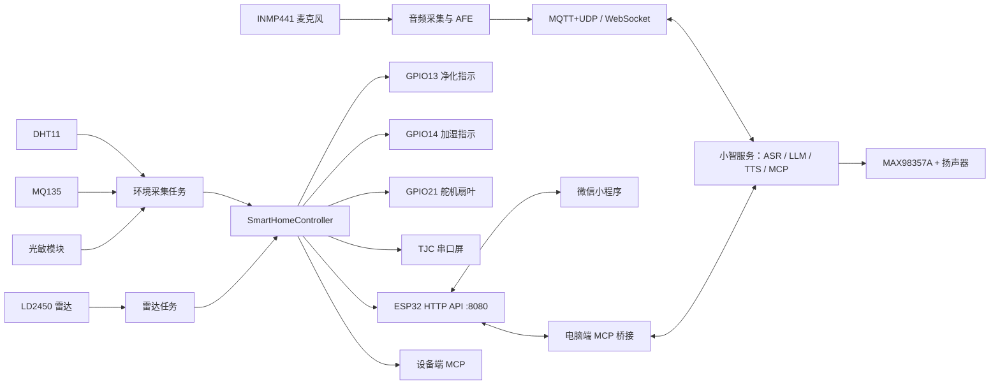

# ESP32-S3 小智 AI 智能家居项目说明书

> 文档日期：2026-07-24  
> 固件工程：`xiaozhi-esp32`  
> 当前固件版本：`2.2.6`  
> 当前目标芯片：ESP32-S3  
> 当前板型：`bread-compact-wifi`  
> 当前语言：简体中文  
> 当前分区：16MB Flash、双 OTA 应用分区、8MB 资源分区

## 1. 项目简介

本项目在开源“小智 AI”ESP32 固件基础上，针对 `bread-compact-wifi` 板型扩展了环境监测、
毫米波雷达、TJC 串口屏、智能家居执行器、局域网 HTTP API、微信小程序和 MCP 工具链。

设备既可以作为联网语音助手使用，也可以作为一套小型 AIoT 智能家居控制终端：

- 通过 INMP441 麦克风采集语音，通过 MAX98357A 功放和扬声器播放语音。
- 通过 Wi-Fi 接入小智服务，完成流式 ASR、LLM、TTS 和 MCP 工具调用。
- 通过 DHT11、MQ135、光敏模块和 LD2450 雷达感知室内环境与人员活动。
- 通过 TJC 4.3 英寸串口屏显示温湿度、空气评分、趋势和智能家居页面。
- 通过 GPIO13、GPIO14 的 PWM 指示灯模拟净化器和加湿器档位。
- 通过 GPIO21 控制 0～180°位置舵机，模拟新风扇叶往复摆动。
- 通过 HTTP API、微信小程序、设备端 MCP 或电脑端 MCP 桥接控制设备。

当前项目不是简单的传感器显示程序，而是形成了“感知—判断—执行—显示—联网控制”的闭环。
不过部分功能仍属于演示级实现，真实家电、电灯和报警器在接入前还需要增加驱动与安全隔离电路。

## 2. 当前软硬件基线

| 项目 | 当前配置 |
| --- | --- |
| 芯片 | ESP32-S3 |
| 开发框架 | ESP-IDF 5.4 及以上；最近记录使用 5.5.2 |
| 工程版本 | `2.2.6` |
| 板型配置 | `CONFIG_BOARD_TYPE_BREAD_COMPACT_WIFI=y` |
| 网络 | Wi-Fi，热点配网 |
| 语音输入 | INMP441，I²S，16kHz |
| 语音输出 | MAX98357A，I²S，24kHz |
| 离线唤醒 | AFE 唤醒词已启用 |
| 音频处理 | AFE 音频处理已启用，支持 Opus 编解码 |
| 云端协议 | 根据 OTA 配置选择 MQTT+UDP 或 WebSocket；缺省回退 MQTT |
| 界面 | TJC 4.3 英寸串口屏，480×272，横屏，UART2 9600 8N1 |
| 传感器周期 | 5000ms |
| 本地 HTTP | Wi-Fi 连接成功后启动，端口 `8080` |
| 历史数据 | RAM 中最近 30 条，按 5 秒采样约覆盖最近 2.5 分钟 |
| Flash 分区 | 两个约 4MB OTA 应用分区，8MB `assets` 分区 |

当前板型返回的是框架 `NoDisplay`，小智原生显示抽象不直接驱动实体 LCD；TJC 屏由本项目的
`SerialHmi` 模块单独管理。因此，原生 OLED/LCD 表情显示能力属于上游框架能力，不代表当前板型
已经接入另一块显示屏。

## 3. 系统总体架构



主要数据链路如下：

1. 传感器任务每 5 秒读取 DHT11、MQ135 和光敏模块。
2. 雷达任务以 100ms 轮询周期接收 LD2450 目标帧。
3. `SmartHomeController` 统一保存环境、人员、模式、报警和执行器状态。
4. 控制器根据自动/节能规则更新 PWM、舵机、逻辑灯光和报警状态。
5. TJC 屏、HTTP API、MCP 工具和微信小程序读取或修改同一套状态。

## 4. 已实现功能

### 4.1 小智 AI 语音功能

- Wi-Fi 热点配网和网络连接。
- AFE 离线唤醒词检测。
- 按键对讲：按下 GPIO47 开始监听，松开停止监听。
- 流式语音上传、ASR、LLM 对话和 TTS 播放。
- MQTT+UDP 与 WebSocket 两种协议框架。
- Opus 音频编解码。
- OTA 版本检查、激活、双分区升级和资源分区更新。
- 设备状态机：启动、配网、空闲、连接、监听、说话、升级、激活和故障状态。
- 设备端 MCP 工具注册和远端工具调用。

ASR、LLM、TTS、声纹识别等高级能力依赖所连接的小智服务端和账号配置，并不是全部在
ESP32 本地运行。

### 4.2 环境监测

#### DHT11 温湿度

- GPIO18 单总线采集。
- 使用开漏输入输出、内部上拉和临界区读取，降低时序错误。
- 单次读取失败时保留最近一次有效温湿度，避免屏幕短暂显示异常值。

#### MQ135 空气质量

- GPIO1 / ADC1_CH0 读取模拟输出。
- 输出 ADC 原始值和演示级空气等级。
- 根据原始值生成 0～100 空气评分、舒适度和环境建议。
- 当前没有完成气体种类、温湿度补偿和 ppm 标定，不能作为专业检测仪使用。

#### GL5528 类光敏模块

- GPIO2 / ADC1_CH1 读取模拟亮度。
- 当前标定：遮光约 `3300`，照亮约 `300`。
- 自动归一化为 0～100% 亮度，并使用权重 `0.25` 的平滑滤波。
- 自动灯光采用 25% 开灯、35% 关灯的回差，避免阈值附近频繁切换。

#### 环境突变报警

满足任一条件会设置报警状态：

- 温度相邻采样变化达到 5°C。
- 湿度相邻采样变化达到 20%。
- 空气评分相邻采样变化达到 30。
- MQ135 原始值相邻采样变化达到 1200。

当前报警通过小智应用的提示与音频回调呈现，没有绑定独立蜂鸣器 GPIO。

### 4.3 LD2450 雷达

- UART1，256000 baud，8N1。
- 支持 `AA FF 03 00 ... 55 CC`、30 字节目标帧解析。
- 最多解析 3 个目标的 X、Y、速度和分辨率数据。
- 统计接收字节、有效帧和拒绝帧，便于排查接线与协议。
- 检测到目标时，将 `occupied` 设置为 `true`，并可触发 AI 开始监听。
- HTTP/MCP 状态中提供 `has_radar_data` 和 `radar_target_count`。

2026-07-24 的实机日志已经出现持续增长的有效帧、`rejected=0` 和稳定目标坐标，说明雷达
供电、UART 接线和目标帧解析已经打通。

当前控制器只使用目标数量。坐标、速度和轨迹目前只打印日志，没有进入区域判断。雷达变成
`targets=0` 时也不会自动设置全屋无人，因为门口暂时没有目标并不能证明屋内无人。

### 4.4 TJC 串口屏

- UART2 双向通信，ESP32 命令使用 `FF FF FF` 结尾。
- 中文文本发送前执行 UTF-8 到 GBK 转码。
- 只刷新当前页面，使用 `ref_stop` / `ref_star` 批量刷新以减少闪烁。
- 缓存最近 30 条空气评分，进入空气详情页时回放趋势曲线。
- 支持触摸按钮、页面跳转、左右滑动和透明热区事件。

当前页面规划：

| 页面 | 功能 |
| --- | --- |
| page0 | 首页：温度、湿度、空气状态、评分、建议、AI 状态 |
| page1 | 空气详情：评分、原始值、温湿度、舒适度和趋势曲线 |
| page2 | 智能家居：净化、新风、加湿、自动和节能模式 |
| page3 | AI 与设置：连接状态、手动环境和场景预设 |

屏幕事件协议：

```text
BTN,PAGE,<HOME|AIR_DETAIL|SMART_HOME|AI|SETTINGS|NEXT|PREV>
SWIPE,<LEFT|RIGHT>
BTN,DEVICE,<AIR_PURIFIER|FAN|HUMIDIFIER>,<TOGGLE|ON|OFF|LEVEL>
BTN,MODE,<AUTO|ECO>,<TOGGLE|ON|OFF>
BTN,ENV,<MANUAL|SCENE>,<TOGGLE|GOOD|HOT|DRY|POLLUTED>
```

如果串口出现 `Unknown screen event`，说明屏幕返回了不符合以上格式的可打印内容；它与
LD2450 的 UART1 数据无关，需要检查 HMI 事件脚本、返回值设置和 UART2 电平。

### 4.5 智能家居控制

所有控制入口共用 `SmartHomeController`：串口屏、HTTP、小程序、设备端 MCP 和电脑端 MCP
桥接不会各自维护独立状态。

已实现的执行器：

| 设备 | 状态 | 实际输出 |
| --- | --- | --- |
| 空气净化器 | 0～3 档 | GPIO13 PWM 指示 LED，0/33/66/100% |
| 加湿器 | 0～3 档 | GPIO14 PWM 指示 LED，0/33/66/100% |
| 新风/风扇 | 0～3 档 | GPIO21 位置舵机往复摆动 |
| 照明灯 | 开/关逻辑 | 尚未绑定独立 GPIO，仅状态、规则、API 和 MCP 可用 |
| 环境报警 | 报警状态与原因 | 小智提示/音频；尚未绑定蜂鸣器 |

舵机档位：

| 档位 | 摆动范围 | 步长 | 步进间隔 |
| ---: | ---: | ---: | ---: |
| 0 | 固定 0° | — | — |
| 1 | 20°～70° | 2° | 90ms |
| 2 | 10°～120° | 3° | 60ms |
| 3 | 0°～180° | 4° | 40ms |

### 4.6 自动模式与节能模式

自动模式规则：

- 湿度低于 40%：加湿器 2 档。
- 湿度高于 70%：关闭加湿器。
- MQ135 原始值达到 1000：净化器至少 2 档。
- MQ135 原始值达到 2000：净化器 3 档，新风至少 2 档。
- 温度高于 30°C：新风至少 2 档。
- MQ135 低于 1000 且无高温条件：关闭新风。

节能模式使用较低档位：

- MQ135 ≥2000 或空气评分 <40：净化器 2 档、新风 1 档。
- MQ135 ≥1000 或空气评分 <65：净化器 1 档。
- 湿度 <35%：加湿器 1 档。
- 温度 >30°C：新风至少 1 档。

如果系统明确得到 `occupied=false`，净化、加湿、新风和灯光会全部关闭。当前真实雷达只会把
状态从未知/无人更新为有人；无人状态仍需 HTTP/MCP 模拟，或后续加入可靠的雷达离开算法。

### 4.7 手动环境与场景测试

为了在无法真实制造高温、干燥和污染环境时验证自动规则，项目提供手动环境模式：

- `GOOD`：舒适环境。
- `HOT`：高温环境。
- `DRY`：干燥环境。
- `POLLUTED`：污染环境。
- 也可以直接输入温度、湿度、空气评分和 MQ135 原始值。
- 退出手动模式后恢复真实传感器采样。

### 4.8 微信小程序

外层目录 `mini_program_demo` 提供局域网微信小程序演示：

- 保存 ESP32 的 `<IP>:8080` 地址。
- 查询实时状态与最近 30 条历史数据。
- 控制净化、新风和加湿的 0～3 档。
- 切换自动模式与节能模式。
- 输入手动环境或选择预设场景。
- 恢复真实传感器数据。

当前小程序直接使用局域网 HTTP，无云服务器、无 HTTPS、无鉴权，适合课堂、答辩和可信网络
联调，不适合直接发布到公网。

### 4.9 MCP 与 AI 联动

设备端已注册的主要智能家居工具：

```text
self.home.get_state
self.home.set_purifier
self.home.set_fresh_air
self.home.set_humidifier
self.home.set_auto
self.home.set_eco
self.home.set_light
self.home.update_context
self.home.acknowledge_alarm
self.home.get_environment_briefing
self.home.set_manual_environment
self.home.set_environment_preset
self.home.get_advice
```

电脑端 `tools/xiaozhi_mcp_bridge` 可以把小智 MCP 调用转发到 ESP32 HTTP API，并额外提供天气、
RSS 新闻和室内外综合建议。桥接需要电脑持续运行，并通过环境变量配置 MCP token、ESP32 地址
和可选新闻源；真实 token 不应写入代码或文档。

## 5. GPIO 与外设连接总表

GPIO 定义以 [`config.h`](../xiaozhi-esp32/main/boards/bread-compact-wifi/config.h) 为准。

| ESP32-S3 GPIO | 方向 | 外设/功能 | 外设连接 | 参数与说明 |
| ---: | --- | --- | --- | --- |
| 0 | 输入 | BOOT 按键 | 另一端接 GND | 低有效；配网/聊天，启动时按住可能进入下载模式 |
| 1 | ADC 输入 | MQ135 | AO | ADC1_CH0，输入不得超过 3.3V |
| 2 | ADC 输入 | 光敏模块 | AO | ADC1_CH1，模块使用 3.3V |
| 4 | 输出 | INMP441 | WS/LRCK | I²S 麦克风帧时钟 |
| 5 | 输出 | INMP441 | SCK/BCLK | I²S 麦克风位时钟 |
| 6 | 输入 | INMP441 | SD/DOUT | I²S 麦克风数据 |
| 7 | 输出 | MAX98357A | DIN | I²S 扬声器数据 |
| 11 | UART 输入 | LD2450 | 雷达 TX | UART1 RX，256000 8N1 |
| 12 | UART 输出 | LD2450 | 雷达 RX | UART1 TX，256000 8N1 |
| 13 | PWM 输出 | 净化器指示 LED | 串限流电阻接 LED | LEDC 5kHz，通道0 |
| 14 | PWM 输出 | 加湿器指示 LED | 串限流电阻接 LED | LEDC 5kHz，通道1 |
| 15 | 输出 | MAX98357A | BCLK | I²S 扬声器位时钟 |
| 16 | 输出 | MAX98357A | LRC/LRCK | I²S 扬声器帧时钟 |
| 18 | 双向开漏 | DHT11 | DATA | 建议 4.7kΩ～10kΩ 上拉到 3.3V |
| 21 | PWM 输出 | 0～180°位置舵机 | 信号线 | LEDC 50Hz，通道2；独立 5V 供电 |
| 39 | 输入 | 音量减 | 另一端接 GND | 单击减 10，长按静音 |
| 40 | 输入 | 音量加 | 另一端接 GND | 单击加 10，长按最大音量 |
| 41 | UART 输出 | TJC 串口屏 | 屏幕 RX | UART2 TX，9600 8N1 |
| 42 | UART 输入 | TJC 串口屏 | 屏幕 TX | UART2 RX，9600 8N1 |
| 47 | 输入 | 说话按键 | 另一端接 GND | 按下监听，松开停止 |
| 48 | 输出 | 板载状态 LED | 板载连接 | 小智状态灯，不作为照明输出 |

没有列出的 GPIO 不等于可以直接使用。增加外设前必须核对具体 ESP32-S3 模组和开发板原理图，
确认 Flash/PSRAM、USB、UART0、JTAG、启动绑带脚和板载器件占用情况。
其中 `GPIO48` 已固定作为板载状态 LED，不应再并接照明灯或其他负载。

## 6. 模块接线与供电

### 6.1 音频

| 模块 | 电源 | 信号 |
| --- | --- | --- |
| INMP441 | 3.3V、GND | WS→GPIO4，SCK→GPIO5，SD→GPIO6；L/R 不得悬空 |
| MAX98357A | 常用稳定 5V、GND | DIN→GPIO7，BCLK→GPIO15，LRC→GPIO16 |

扬声器只能接 MAX98357A 的 `SPK+` 与 `SPK-`，不得把其中一端接地。

### 6.2 传感器

| 模块 | 电源 | 信号 |
| --- | --- | --- |
| DHT11 | 3.3V、GND | DATA→GPIO18，建议外部上拉 |
| MQ135 | 常见模块使用 5V、GND | AO→GPIO1；接入前确认 AO ≤3.3V，必要时分压 |
| 光敏模块 | 3.3V、GND | AO→GPIO2；不要用导致 AO 超过 3.3V 的供电 |
| LD2450 | 稳定 5V、GND | TX→GPIO11，RX→GPIO12，必须交叉连接 |

### 6.3 屏幕与执行器

| 模块 | 电源 | 信号 |
| --- | --- | --- |
| TJC 串口屏 | 按屏幕规格，当前通常 5V | RX→GPIO41，TX→GPIO42 |
| 净化指示 LED | GPIO 信号 | GPIO13→限流电阻→LED→GND |
| 加湿指示 LED | GPIO 信号 | GPIO14→限流电阻→LED→GND |
| 位置舵机 | 独立稳定 5V、公共 GND | 信号→GPIO21 |

### 6.4 供电安全

- 所有模块必须与 ESP32 共地。
- ESP32 GPIO 只能承受 3.3V 逻辑电平。
- 屏幕、雷达、功放、MQ135 加热器和舵机不能由 GPIO 供电。
- 舵机、屏幕、功放和雷达同时工作时，5V 电源应留足峰值电流余量。
- 出现 `Brownout detector was triggered` 时，应先断开大电流负载并检查电源压降，而不是继续修改软件。
- GPIO13、GPIO14 只能直接带小功率指示 LED。连接继电器、风机、灯带或真实家电必须增加
  三极管/MOSFET、续流二极管、光耦或合规继电器模块。
- 市电设备必须使用有隔离、有保险和有外壳的成品控制模块，不能把市电直接接到面包板。

## 7. 本地 HTTP API

设备连接 Wi-Fi 后，在 `http://<ESP32_IP>:8080` 提供以下接口：

| 方法 | 路径 | 用途 |
| --- | --- | --- |
| GET | `/api/state` | 查询执行器、模式、环境、雷达、亮度和报警状态 |
| GET | `/api/history` | 查询最近 30 条环境历史 |
| POST | `/api/device` | 控制净化、新风、加湿或逻辑灯光 |
| POST | `/api/mode` | 开关自动或节能模式 |
| POST | `/api/environment` | 设置手动环境、场景或恢复传感器 |
| POST | `/api/context` | 联调占用状态和环境亮度 |
| POST | `/api/alarm/ack` | 确认并清除报警 |
| OPTIONS | `/api/*` | CORS 预检 |

示例：

```powershell
# 查询状态
Invoke-RestMethod -Method Get -Uri "http://192.168.1.23:8080/api/state"

# 净化器二档
Invoke-RestMethod -Method Post `
  -Uri "http://192.168.1.23:8080/api/device" `
  -ContentType "application/json" `
  -Body '{"device":"purifier","power":true,"level":2}'

# 开启自动模式
Invoke-RestMethod -Method Post `
  -Uri "http://192.168.1.23:8080/api/mode" `
  -ContentType "application/json" `
  -Body '{"mode":"auto","power":true}'

# 模拟污染环境
Invoke-RestMethod -Method Post `
  -Uri "http://192.168.1.23:8080/api/environment" `
  -ContentType "application/json" `
  -Body '{"enabled":true,"preset":"POLLUTED"}'
```

HTTP API 当前没有身份认证，同一局域网内的其他设备都可能调用，因此只应在可信网络中使用。

## 8. 按键操作

| 按键 | 操作 | 功能 |
| --- | --- | --- |
| BOOT / GPIO0 | 单击 | 启动阶段进入配网；正常阶段切换聊天状态 |
| 说话 / GPIO47 | 按下 | 开始监听 |
| 说话 / GPIO47 | 松开 | 停止监听 |
| 音量加 / GPIO40 | 单击 | 音量增加 10，最高 100 |
| 音量加 / GPIO40 | 长按 | 最大音量 |
| 音量减 / GPIO39 | 单击 | 音量减少 10，最低 0 |
| 音量减 / GPIO39 | 长按 | 静音 |

## 9. 工程目录说明

```text
xiaozhi-esp32/                         外层工作目录
├── document/                         面向使用者的中文说明书、接线文档与资料
├── mini_program_demo/                 微信小程序局域网演示工程
└── xiaozhi-esp32/                     ESP-IDF 固件工程
    ├── main/
    │   ├── application.*              小智应用状态机和主业务
    │   ├── audio/                     音频采集、处理、编解码和唤醒
    │   ├── protocols/                 MQTT+UDP、WebSocket 协议
    │   ├── mcp_server.*               设备端 MCP 服务
    │   ├── ota.*                      版本检查和 OTA 升级
    │   ├── display/                   上游显示抽象
    │   └── boards/
    │       ├── common/                公共板级基类和驱动
    │       └── bread-compact-wifi/    当前自定义板全部实现
    ├── partitions/v2/16m.csv          当前分区表
    ├── hmi/                           TJC/USART HMI 屏幕工程源码
    ├── tools/xiaozhi_mcp_bridge/      电脑端智能家居 MCP 桥接
    ├── tests/                         源码契约和桥接单元测试
    ├── scripts/                       构建、资源、MCP 启动和 HTTP 联调脚本
    ├── sdkconfig                      本地构建配置（自动生成，不提交 Git）
    └── CMakeLists.txt                 ESP-IDF 工程入口
```

当前板型关键文件：

| 文件 | 职责 |
| --- | --- |
| `compact_wifi_board.cc` | 板级入口、传感器任务、雷达任务、屏幕事件、按键和 HTTP 启动 |
| `config.h` | GPIO、UART、ADC、I²S、PWM 和采样参数 |
| `serial_hmi.*` | TJC 通信、GBK 转码、页面刷新、曲线和事件解析 |
| `dht11_sensor.*` | DHT11 单总线驱动 |
| `mq135_sensor.*` | MQ135 ADC 读取和演示级等级 |
| `ambient_light_sensor.*` | 光敏 ADC 读取 |
| `ambient_light_filter.*` | 光敏归一化与平滑滤波 |
| `ld2450_sensor.*` | 雷达 UART 收包、缓存和诊断 |
| `ld2450_protocol.*` | 雷达目标帧解析 |
| `smart_home_controller.*` | 状态、规则、PWM、舵机、报警和 MCP 工具 |
| `smart_home_http_server.*` | 局域网 HTTP API |
| `serial_hmi_widgets.json` | 页面、控件、资源和事件契约 |

## 10. 构建、烧录和监视

在固件工程目录执行：

```powershell
cd D:\Project\VSCode-project\xiaozhi-esp32\xiaozhi-esp32

# 先加载本机 ESP-IDF 环境，再构建
idf.py build

# 烧录并打开串口监视器
idf.py flash monitor
```

当前 `sdkconfig` 已选择 ESP32-S3、`bread-compact-wifi`、16MB v2 分区和简体中文。没有明确需要时，
不要执行 `idf.py set-target`、`menuconfig` 或 `fullclean`，以免改变已经验证过的配置并失去增量编译缓存。

首次上电建议按以下顺序检查：

1. 没有 Brownout、Guru Meditation 或反复重启。
2. Wi-Fi 配网和连接成功。
3. INMP441、MAX98357A、按键和音量正常。
4. DHT11、MQ135、光敏读数正常。
5. LD2450 的 `bytes`、`valid` 持续增长，`rejected` 不异常增长。
6. TJC 屏能刷新数据并返回规定格式的事件。
7. GPIO13、GPIO14 指示灯和 GPIO21 舵机按 0～3 档动作。
8. 浏览器能打开 `/api/state`，再验证小程序与 MCP。

## 11. 测试与验证现状

工程包含两类 Python 回归测试：

- `test_bread_compact_wifi_regressions.py`：检查 DHT11、HMI、执行器、自动/节能规则、雷达、光敏、
  HTTP API、小程序契约和关键源码结构。
- `test_xiaozhi_mcp_bridge.py`：检查电脑端 MCP 桥接的状态、设备、模式、环境、天气、新闻和综合建议。

运行方式：

```powershell
cd D:\Project\VSCode-project\xiaozhi-esp32\xiaozhi-esp32
python -m unittest discover -s tests -v
```

这些测试主要属于源码和接口契约测试，不能替代电源、串口电平、传感器精度、舵机机械范围和
真实家电负载的实机验证。

## 12. 当前限制与已知风险

1. MQ135 只有原始 ADC 和经验评分，没有完成专业浓度标定。
2. 当前没有 PM2.5、CO2、TVOC 的真实传感器。
3. 净化器和加湿器输出目前是指示 LED，不是真实家电驱动。
4. `light_on` 只有逻辑状态，没有分配独立照明 GPIO。
5. 报警没有绑定实体蜂鸣器。
6. LD2450 坐标和速度没有进入区域、轨迹和进出人数算法。
7. 雷达无目标不会自动判断无人，避免门口雷达误关全屋设备。
8. TJC 屏对不符合事件协议的返回内容会打印 `Unknown screen event`。
9. 历史数据仅保存在 RAM，重启后丢失，只保留最近 30 条。
10. HTTP API 无鉴权、无 TLS，只适合可信局域网。
11. 微信小程序局域网 HTTP 方案可能受真机域名和网络隔离策略影响。
12. 多个 FreeRTOS 任务、HTTP 和 MCP 可能同时访问控制器状态，后续扩大功能时应增加互斥保护。
13. 大电流外设共用 5V 时存在压降和 Brownout 风险。
14. HMI 工程源码位于 `xiaozhi-esp32/hmi/`；编辑器中的控件、事件或资源变化需要与固件契约一起提交。

## 13. 建议增加的功能

### 13.1 第一优先级：把现有闭环做可靠

#### 雷达完整融入

- 增加 X/Y 有效区域、最近距离和目标速度过滤。
- 房间覆盖模式：连续多帧确认有人，连续 60～120 秒无目标后确认无人。
- 门口模式：建立门内/门外区域和轨迹状态机，统计进入、离开和屋内人数。
- 向 HTTP、MCP、小程序和 HMI 输出目标坐标、最近距离、区域、最后出现时间和进出事件。
- AI 自动开麦增加冷却时间，并只在合适的应用状态下触发。

#### 接入真实灯光和报警器

- 为灯光选择经过原理图确认的空闲 GPIO。
- 低压灯带使用 MOSFET 驱动；继电器使用带光耦和续流保护的模块。
- 增加蜂鸣器驱动、静音和报警等级。
- 把 `SetLightOutputCallback()` 和报警回调绑定到真实硬件。

#### 处理串口屏异常返回

- 抓取 UART2 原始十六进制数据，区分文本事件、TJC 返回码和页面回传帧。
- 只对完整的 `BTN,...` / `SWIPE,...` 文本做事件解析。
- 在 HMI 工程中清理多余 `print/prints`，统一事件结束符。

### 13.2 第二优先级：提升传感器和数据价值

- 接入 PMSA003/PMS5003 等 PM2.5 传感器。
- 接入 SCD40/SCD41 或 SenseAir 类 CO2 传感器。
- 接入 SGP30/SGP40 等 TVOC 传感器。
- 用更稳定的 SHT30/SHT40 替代 DHT11。
- 对 MQ135 增加预热、基线、温湿度补偿和标定流程。
- 把历史数据写入 NVS、SPIFFS、SD 卡或局域网数据库，支持小时/天/周趋势。
- 增加 RTC/NTP 时间戳，使报警和历史记录可追溯。

### 13.3 第三优先级：完善智能家居能力

- 增加场景：离家、回家、睡眠、会客、空气净化、节能。
- 增加规则编辑器，让阈值和延时可从屏幕、小程序或网页修改。
- 接入 Home Assistant、标准 MQTT Topic 或 Matter 网关。
- 增加设备状态反馈，区分“已下发命令”和“真实设备已经动作”。
- 增加电流、电压和功耗采集，实现能耗统计与异常断电保护。
- 增加窗帘、门磁、漏水、烟雾、燃气等传感器，但必须重新规划 GPIO 和供电。

### 13.4 第四优先级：安全与产品化

- 为 HTTP API 增加 token、会话认证、请求频率限制和可选 HTTPS/反向代理。
- 敏感配置使用 NVS 或环境变量，不把 Wi-Fi、MCP token 写进仓库。
- 为共享状态增加 FreeRTOS mutex，并为传感器/执行器增加超时和故障状态。
- 增加看门狗、任务存活监控、错误计数和一键导出诊断信息。
- 对 HMI 工程、固件版本、资源版本和硬件版本建立统一版本号。
- 制作 PCB、保险丝、反接保护、电源滤波和外壳，替代长期面包板运行。

### 13.5 可选 AI 扩展

- 将雷达、环境和设备状态组合成主动环境播报。
- 根据室内外天气自动给出开窗、净化、加湿和出行建议。
- 增加本地关键词命令，在断网时仍能控制基础设备。
- 增加摄像头、视觉识别或人脸交互，但需要重新评估 PSRAM、带宽、功耗和 GPIO。
- 对报警增加手机通知、企业微信/邮件或 Home Assistant 推送。

## 14. 相关文档

- [板级代码连线表](板级代码连线表.md)
- [硬件连接与软件验证步骤](硬件连接与软件验证步骤.md)
- [LD2450 雷达与光敏模块接线验证](LD2450雷达与光敏模块接线验证.md)
- [串口屏设计说明](串口屏设计说明.md)
- [串口屏手动事件配置手册](串口屏手动事件配置手册.md)
- [智能家居外设接线与验证步骤](智能家居外设接线与验证步骤.md)
- [串口屏与环境监测项目交付说明](串口屏与环境监测项目交付说明.md)
- [小智固件中文 README](../xiaozhi-esp32/README_zh.md)
- [电脑端 MCP 桥接说明](../xiaozhi-esp32/tools/xiaozhi_mcp_bridge/README.md)

## 15. 维护原则

- 功能描述以当前源码和 `sdkconfig` 为准，不以旧截图或旧阶段文档为准。
- 修改 GPIO 后同步更新 `config.h`、接线表、说明书和实机标签。
- 修改 HMI 控件或事件后同步更新 `serial_hmi_widgets.json` 和 HMI 工程。
- 新增真实负载前先完成电压、电流、隔离和共地检查。
- 每次固件升级至少回归：语音、传感器、雷达、屏幕、执行器、HTTP 和小程序。
- 发现 Brownout、串口乱码或重启时，先保存完整日志，再按供电、接线、协议、软件的顺序排查。
